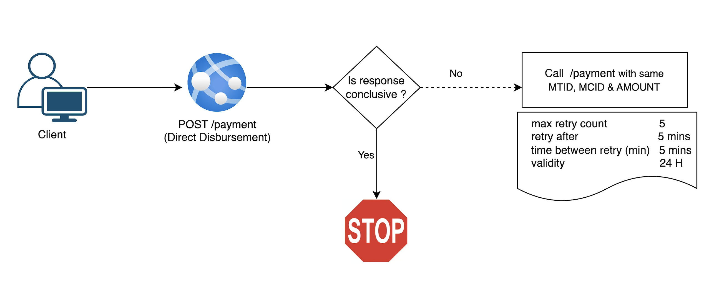
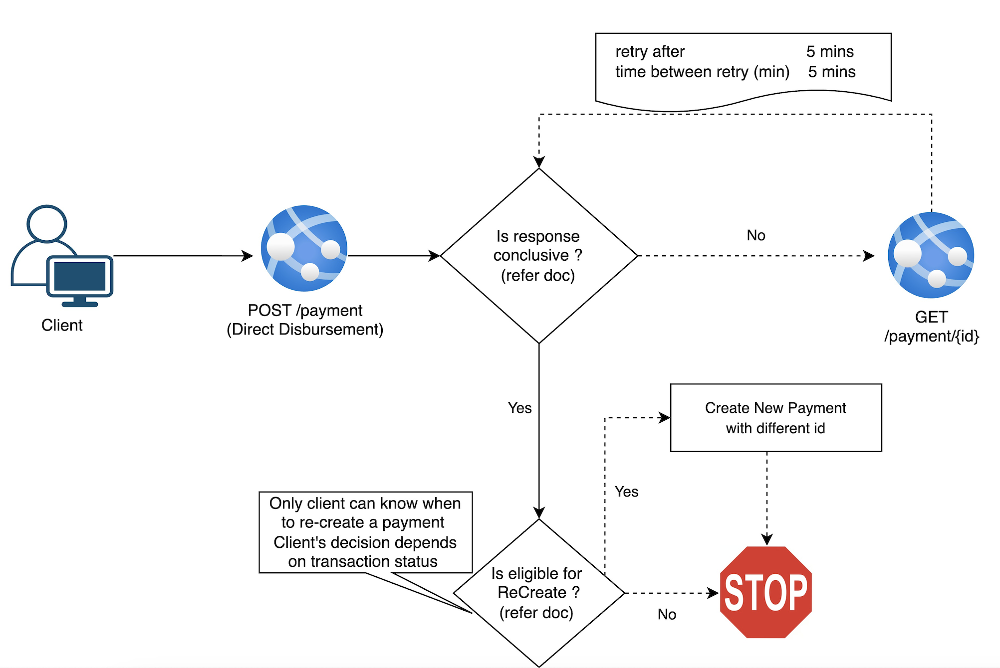

> Only applicable to Direct Disbursemnt Merchants 

### Conclusive & Inconclusive Resposnes 
 - When client makes disburse payment request, the response can be either conclusive or inconclusive 
 - A conclusive response, is the one where client is sure of transaction status, Even if its declined. It includes, 
 - `HTTP 4XX` Declined due to error in client input 
 - `HTTP 2XX`  Approved (Except IP transaction status)
 - An inconclusive response, is the one where client is not sure of transaction status, Even if client gets 2xx response. It includes,
 - `HTTP 5XX` Server Errors 
 - `HTTP 2XX `with In Progress Status 
 - `Timeouts`
 - [Refer](Transaction-payment-status.md) for more info

### Timeouts
 - Timeouts usually happens, when a (system/program) tired to connecto to server, but it didn't recieve a response in expected timeframe. This could be due to 
   - Network issues (or)
   - Server overload (or)
   - Intermidiate node failures (or)
   - Various other reasons
 - Timeout can happen anywhere between source and destination, Ex 
   - Between Merchant and Merchant's proxy 
   - Between Merchant and DDP
   - Between DDP and Payment Providers (VISA or Master)
   - Payment Provider (VISA or Master) and Issuer Bank
 - Timeouts are inevitable, but they are very infrequent. Usually 99.99 % request will not get any timeout. 
 - When a timeout occuers, The client cannot determine if the request reached the server or not. 

> To recover from iconclusive responses and avoid the risk of duplicate payments, Merchant should adopt one of two below practices, 

### Idempotency
  - With Idempotency, DDP gurantees a single fund transfer per payment, even with duplicate requests
  - In order for a paymemt to qualify for idempotency, It should have same 
    - MTID (Merchant Transaction Id)
    - MCID (Merchant Customer Id)
    - Payment Amount
  - In case of Inconclusive response, Merchant should wait for 5 minutes, then retry the same payment
  - If DDP identifies the payment has a duplicate, DDP will return the current status
  - Otherwise, DDP will process the payment, business as usual
  - Merchants are permitted to retry the same payment up to 5 times
  - Merchants are permitted to retry the same payment with in 24 hours of initial request



### Status Checks 
  - In case of Inconclusive response, Merchant should retrieve current payment status after 5 minutes of initial request
  - If payment status is conlcusive, Merchant should take appropriate action 
  - If payment status is inconclusive, Merchant should retry status check api again 
  - Merchants are permitted to retry status check for maximum of 5 times with 5 minutes gap 



### Inonclusive Response Examples 

``` json
// 2XX In Progress for Disburse Payment

```

``` json
// 5XX for Disburse Payment

```

``` json
// 2XX In Progress for Status Check
```

``` json
// 5XX for Status Check

```

### Certification
> TBA